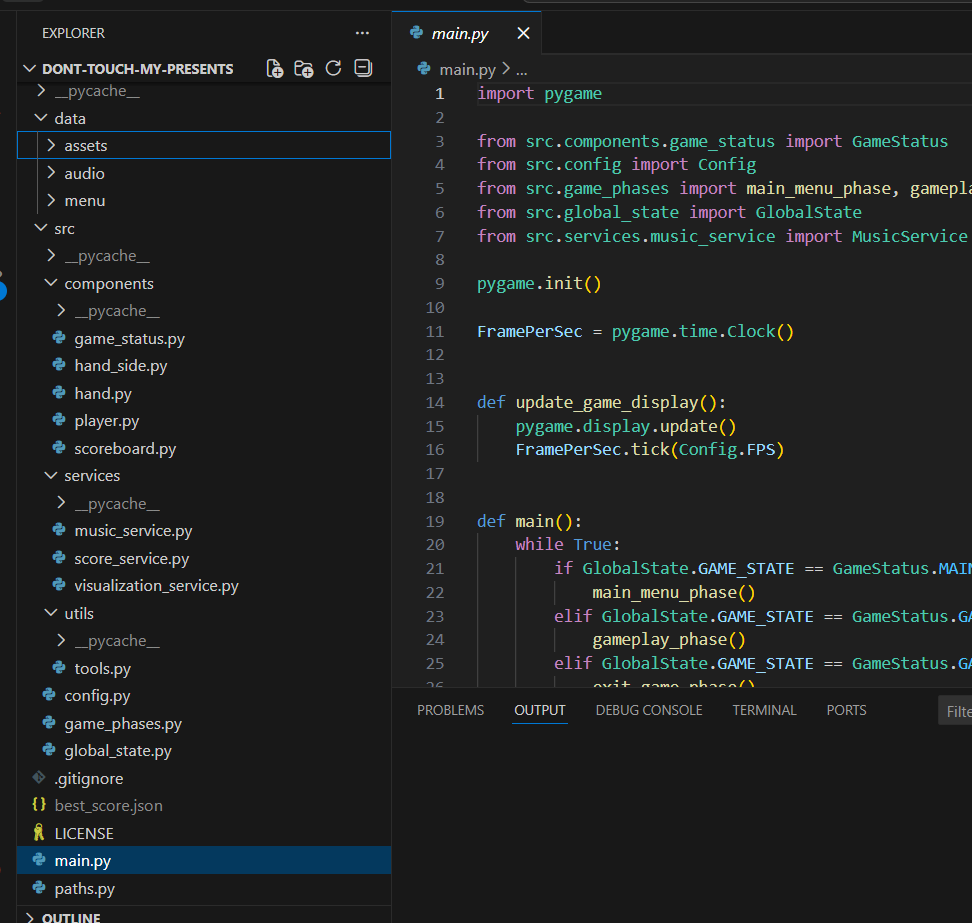
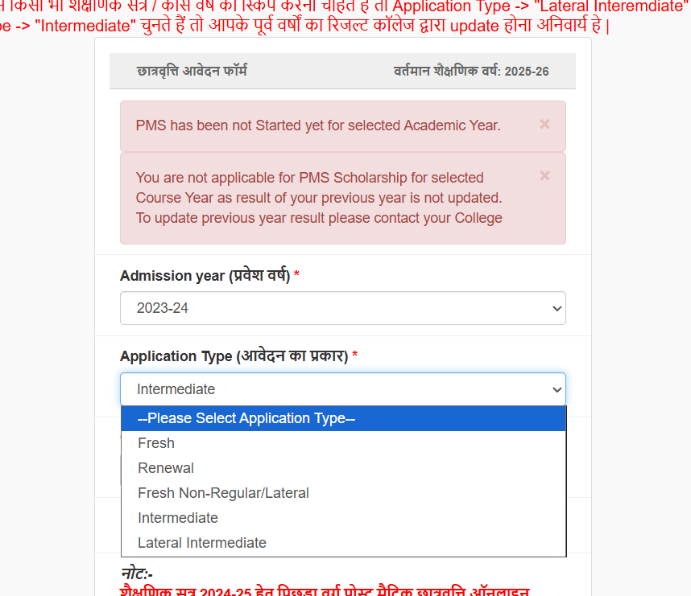

# 🌐 Richa Dhusiya | Personal Portfolio Website

A responsive personal portfolio website built using HTML, CSS, and JavaScript to showcase my skills, projects, certifications, and contact information.

## 🚀 Live Demo

🔗 https://richadhusiya15.github.io/my-portfolio/

## 📌 Features

- Responsive design for desktop and mobile devices
- Clean and modern user interface
- About Me section
- Skills showcase
- Projects section with GitHub repository links
- Certifications section
- Contact dropdown with Email, GitHub, LinkedIn, and Resume
- Image preview for project screenshots
- Smooth scrolling navigation

## 🛠️ Built With

- HTML5
- CSS3
- JavaScript
- Font Awesome

## 📂 Project Structure

```
my-portfolio/
│
├── index.html
├── style.css
├── script.js
├── profile.jpeg
├── projects/
├── assets/
├── README.md
└── resume.pdf
```

## 📸 Preview






## 📬 Contact

**Richa Dhusiya**

📧 Email: richadhusiya@gmail.com

💼 LinkedIn:
https://www.linkedin.com/in/richadhusiya15

🐙 GitHub:
https://github.com/Richadhusiya15

---

⭐ If you like this project, consider giving it a star!